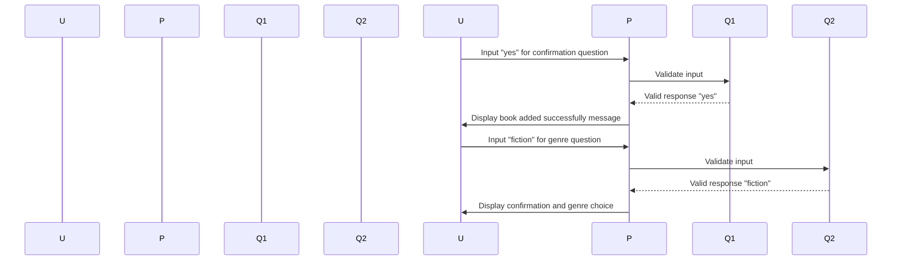

# Chapter 1: Input Handling and Validation

Welcome to our journey into building robust console applications! In the previous chapter, we started exploring how to create commands that can be executed from the command line. However, there's an important aspect we haven't covered yet—ensuring that the input provided by users is valid before proceeding with execution. Think of it like a gatekeeper at an event who checks IDs and only allows entry if they meet specific criteria.

## Why Validation Matters

Imagine you're building a console application to manage a library. You have a command to add books, but what happens when someone inputs invalid data? For example, entering a negative number for the book's price or leaving fields blank. Without proper validation, your program might crash or produce incorrect results. This is where input handling and validation come in.

## Key Concepts

### 1. Question Class
The `Question` class acts as our gatekeeper. It ensures that user inputs are valid before proceeding with any further actions. Let's break down how it works.

#### Example Scenario: Adding a Book
Suppose we want to add a new book to the library using a command-line interface. We need to ask for the book's title, author, and price. If any of these fields are invalid (e.g., an empty string or a negative number), our program should not proceed.

### 2. Setting Up Questions
In the `Question` class, we can set up questions with default values and validators. For instance, when asking for the book's title, if no value is provided by the user, it defaults to "Unknown". If the price is inputted incorrectly (e.g., a negative number), the program will throw an error.

### 3. Using Choice Questions
Sometimes, users might need to make choices from predefined options. For example, we could ask them to select if the book is fiction or non-fiction. The `ChoiceQuestion` class ensures that only valid choices are accepted.

## How to Use It

Let's see how we can use these classes in a practical scenario:

### Example Code
Here’s a simple example of setting up questions and handling user input using the `Question` and `ChoiceQuestion` classes.

```php
<?php

use Symfony\Component\Console\Question\ConfirmationQuestion;
use Symfony\Component\Console\Question\Question;

// Create a confirmation question to ask if the book should be added.
$confirmQuestion = new ConfirmationQuestion("Do you want to add this book? (yes/no): ", true);

// Create a choice question for the genre of the book.
$genreQuestion = new ChoiceQuestion("What is the genre of the book?", ["fiction", "non-fiction"], "fiction");

// Ask the user questions and handle their responses.
$helperSet = \Symfony\Component\Console\Helper\HelperSet::create();
$io = $helperSet->get('io');
$response = $io->ask($confirmQuestion);
$genre = $io->ask($genreQuestion);

echo "Book added successfully with confirmation: $response, Genre: $genre\n";
```

### Step-by-Step Explanation
1. **Create Confirmation Question**: We ask the user if they want to add a book.
2. **Create Choice Question**: We give the user options for the genre of the book.
3. **Ask Questions and Handle Responses**: The program waits for user input, validates it using built-in validators, and handles any errors.

### Internal Walkthrough
When you run this code:
- First, you’ll be prompted with a confirmation question: `Do you want to add this book? (yes/no): yes`
- Then, another prompt will appear asking about the genre: `What is the genre of the book? [fiction, non-fiction]: fiction`

If any input is invalid, an error message will be displayed.

### Mermaid Diagram
Here’s a simple sequence diagram illustrating the flow:


## Conclusion
In this chapter, we learned how to handle user inputs using the `Question` class. We saw how to create questions with validation and choices, ensuring that our application handles invalid data gracefully. Next, we’ll dive deeper into the internal implementation of these classes.

Stay tuned for the next chapter where we will explore more about event handling and dispatching! [Next Chapter: Event Handling and Dispatching](03_event_handling_and_dispatching_.md)

---

Generated by [AI Codebase Knowledge Builder](https://github.com/The-Pocket/Tutorial-Codebase-Knowledge)