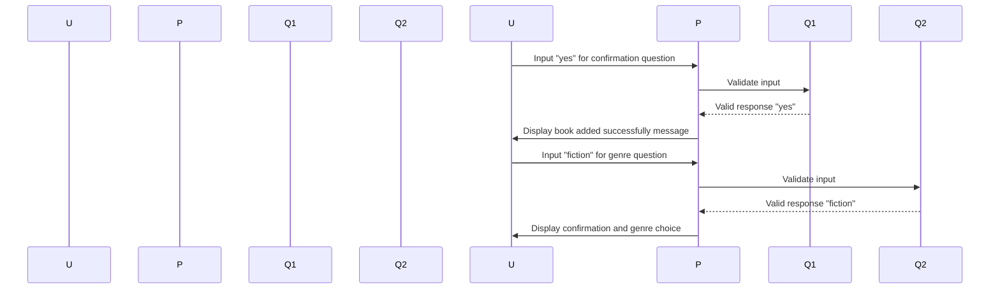

# Chapter 2: Input Definition and Validation

Welcome back! In our last chapter, we explored how to handle user inputs in our console applications. Now, let's take it one step further by defining the rules for those inputs—essentially creating a set of guidelines that ensure users provide valid data.

## Why Do We Need This?

Imagine you're building an application where users can add books to a library. You want them to be able to enter details like the book's title, author, and price. However, what if someone types in a negative price or forgets to fill out required fields? To avoid such issues, we need to define these rules and check that users follow them.

## Key Concepts

### 1. Setting Up Questions
Think of questions as the gatekeepers at an event. They ensure only valid entries get through. In our library app scenario, we'll set up a series of questions for users to answer when adding a book.

```php
use Symfony\Component\Console\Question\ConfirmationQuestion;
use Symfony\Component\Console\Question\Question;

// Create confirmation and choice questions.
$confirmQuestion = new ConfirmationQuestion("Do you want to add this book? (yes/no): ", true);
$genreQuestion = new ChoiceQuestion("What is the genre of the book?", ["fiction", "non-fiction"], "fiction");

// Ask users questions and handle their responses.
$response = $io->ask($confirmQuestion);
$genre = $io->ask($genreQuestion);

echo "Book added successfully with confirmation: $response, Genre: $genre\n";
```

### 2. Using the Question Class
The `Question` class is like a form where you can ask for specific pieces of information. You can create questions that require yes/no answers or multiple-choice options.

- **ConfirmationQuestion**: Asks a user to confirm something.
- **ChoiceQuestion**: Provides users with a list of choices from which they must select one.

### Example Walkthrough
Let's walk through an example where we use these classes:

1. We ask the user if they want to add a book. If they say "yes," we proceed; otherwise, nothing happens.
2. Next, we ask them to choose the genre of the book from two options: fiction or non-fiction.

If any input is invalid (e.g., an empty response), the program will display an error message and not proceed with adding the book.

## Sequence Diagram
Here’s a simple sequence diagram illustrating how these questions work:



## How It Works Internally
Now, let's peek under the hood. The `Question` class handles user inputs by validating them based on predefined rules.

1. **Create Questions**: Define what kind of question it is (confirmation or choice).
2. **Ask for Input**: Display the question to the user.
3. **Validate Response**: Check if the response meets the expected criteria.
4. **Handle Errors**: If the input isn't valid, display an error message and ask again.

## Internal Implementation
Let's look at how this works with some simple code snippets:

### Example Code

```php
<?php

use Symfony\Component\Console\Question\ConfirmationQuestion;
use Symfony\Component\Console\Question\ChoiceQuestion;

// Create a confirmation question.
$confirmQuestion = new ConfirmationQuestion("Do you want to add this book? (yes/no): ", true);

// Create a choice question.
$genreQuestion = new ChoiceQuestion("What is the genre of the book?", ["fiction", "non-fiction"], "fiction");

// Ask users questions and handle their responses.
$response = $io->ask($confirmQuestion);
$genre = $io->ask($genreQuestion);

echo "Book added successfully with confirmation: $response, Genre: $genre\n";
```

### Explanation
1. **Creating Questions**: We define the type of question we want to ask (confirmation or choice) and provide default values if needed.
2. **Asking for Input**: The `ask` method displays the question to the user and waits for their response.
3. **Validating Response**: If the input is invalid, an error message is displayed.

## Conclusion
In this chapter, we learned how to use the `Question` class to define rules for user inputs in our console applications. We saw how to create confirmation questions and choice questions, ensuring that users provide valid data before proceeding with further actions. Next, we’ll dive into event handling and dispatching!

Stay tuned for the next chapter: [Event Handling and Dispatching](03_event_handling_and_dispatching_.md)

---

Generated by [AI Codebase Knowledge Builder](https://github.com/The-Pocket/Tutorial-Codebase-Knowledge)