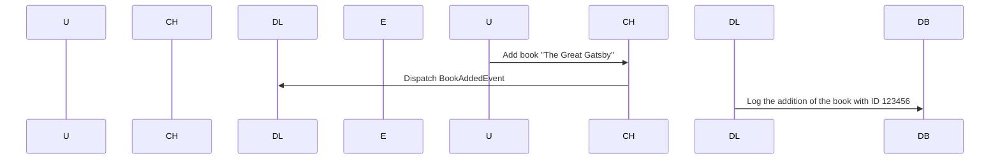

# Chapter 3: Event Handling and Dispatching

Welcome back! In our last chapters, we learned about handling user inputs in our console applications and setting up validation rules to ensure those inputs are correct. Now, let's dive into how events work in these systems, much like traffic lights control the flow of vehicles on a road.

## Why Do We Need Event Handling?

Imagine you're building an application where users can add books to a library. When someone adds a book, various things might happen—like updating the database, sending a notification, or logging the action. How do we make sure all these actions are handled correctly and efficiently? That's where event handling comes in.

## Key Concepts

### 1. What is an Event?
An event is like a signal that tells our application something important has happened. For example, when a user adds a book, it triggers the "book added" event.

### 2. Event Handling
Event handling means catching these signals and responding to them. Our application can listen for specific events and then perform actions based on those events.

## Example Scenario: Adding a Book

Let's use our library example again. When a user wants to add a book, here are the steps we might want to follow:

1. Validate the input (like checking if the price is positive).
2. Log the action in a database.
3. Send a notification to other parts of the system.

We can set up events for each of these actions and ensure they all work smoothly together.

## How It Works

Imagine we have an event like "BookAddedEvent". When this event happens, our application will take note and perform the necessary actions.

### 1. Defining Events
First, we define what kind of events we want to handle. For example:

```php
// In BookAddedEvent.php
class BookAddedEvent {
    private $bookId;

    public function __construct($bookId) {
        $this->bookId = $bookId;
    }

    public function getBookId() {
        return $this->bookId;
    }
}
```

### 2. Dispatching Events
When a book is added, we dispatch (or trigger) the event:

```php
// In AddBookCommand.php
public function execute(InputInterface $input, OutputInterface $output) {
    // Validate and add the book to the database.
    
    $bookId = $this->database->addBook($title, $author, $price);
    
    // Dispatch the event
    $eventDispatcher->dispatch(new BookAddedEvent($bookId));
}
```

### 3. Handling Events
Other parts of our application can listen for this event and perform actions:

```php
// In DatabaseLogger.php
use Symfony\Component\EventDispatcher\EventSubscriberInterface;

class DatabaseLogger implements EventSubscriberInterface {
    public static function getSubscribedEvents() {
        return [
            BookAddedEvent::class => 'logBookAddition',
        ];
    }

    public function logBookAddition(BookAddedEvent $event) {
        $bookId = $event->getBookId();
        // Log the book addition in a database
        echo "Logging that book with ID $bookId was added.\n";
    }
}
```

### 4. Example Walkthrough

Let's walk through an example sequence diagram to see how this works:



## Internal Implementation

Now, let's look at what happens step-by-step:

1. **User Inputs a Command**: The user adds a book.
2. **Command Handler Validates and Adds the Book**: It checks if all inputs are valid and adds the book to the database.
3. **Dispatch Event**: The `BookAddedEvent` is dispatched with the book's ID.
4. **Event Listeners Handle the Event**: The `DatabaseLogger` listens for this event and logs the addition in a database.

## Conclusion

In this chapter, we learned about event handling and dispatching. We saw how events help coordinate different parts of an application to ensure everything works smoothly together. Next, we'll explore more advanced concepts like command execution flow, which will take us one step further in building robust applications.

Stay tuned for the next chapter: [Command Execution Flow](04_command_execution_flow_.md)

---

Generated by [AI Codebase Knowledge Builder](https://github.com/The-Pocket/Tutorial-Codebase-Knowledge)