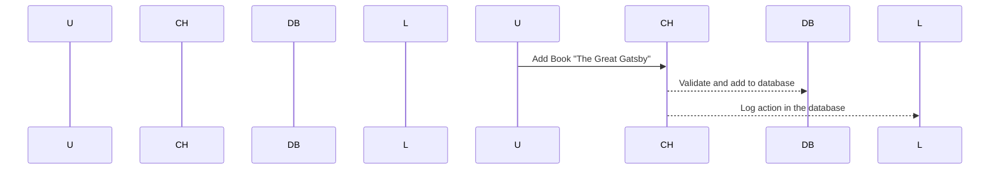

# Chapter 4: Command Execution Flow

Welcome back! In our previous chapters, we explored how to handle user inputs and define validation rules in our console applications. Now, let's dive into the concept of command execution flow. This is like choreographing a dance where each step (command) has its role.

## Motivation

Imagine you're building an application that allows users to manage a library. Users can add books, remove books, and list all available books. Each action is a command in our console app. To ensure these commands work smoothly, we need a structured way to handle their execution. This is where the concept of "Command Execution Flow" comes in.

## Key Concepts

### What is Command Execution Flow?

Think of it like organizing a school play. You have actors (commands) who each have specific roles and follow a script (execution flow). Just as a director ensures everything runs smoothly, we need to structure our commands so they execute correctly.

### How Does It Work?

Let's use the library example again. When a user wants to add a book, here are the steps:

1. **Validate Input**: Ensure the user inputs valid data.
2. **Execute Command**: Add the book to the database.
3. **Notify Other Systems**: Send a notification if needed.

We'll set up events for each of these actions and make sure they work together seamlessly.

## How to Use It

### Example Scenario: Adding a Book

Let's walk through adding a book step-by-step:

1. **User Input**: The user provides the title, author, and price.
2. **Validation**: We check if all inputs are valid (e.g., non-negative prices).
3. **Add to Database**: If validation passes, we add the book to our database.
4. **Log Action**: Log this action in a database for tracking.

### Example Code

Here’s how we can set up these steps using Symfony Console:

```php
<?php

use Symfony\Component\Console\Application;
use Symfony\Component\Console\Command\Command;

// Create an Application instance
$application = new Application('Library App', '1.0');

// Define the add book command
class AddBookCommand extends Command {
    protected function configure() {
        $this
            ->setName('add-book')
            ->setDescription('Add a book to the library');
    }

    protected function execute(InputInterface $input, OutputInterface $output) {
        // Validation: Check if all inputs are valid
        $title = $input->getArgument('title');
        $author = $input->getArgument('author');
        $price = (float)$input->getArgument('price');

        if ($price < 0) {
            throw new \Exception("Price cannot be negative.");
        }

        // Add the book to the database
        $database = new Database();
        $bookId = $database->addBook($title, $author, $price);

        // Log action in a database
        logAction('Add Book', 'Library App', $bookId);

        return 0;
    }
}

// Add the command to the application
$application->add(new AddBookCommand());

// Run the application
$exitCode = $application->run();
```

### Explanation

1. **Application**: We create an `Application` instance with a name and version.
2. **Add Book Command**: We define a new `Command` class that handles adding books.
3. **Validation**: Inside the command, we check if the price is valid.
4. **Database Interaction**: If validation passes, we add the book to our database.
5. **Logging**: We log the action in a database for tracking.

## Internal Implementation

Now, let's see what happens step-by-step when this command executes:

1. **User Inputs**:
   - The user provides `title`, `author`, and `price`.
2. **Validation**:
   - The command checks if the price is valid.
3. **Execute Command**:
   - If validation passes, it adds the book to the database.
4. **Log Action**:
   - It logs the action in a database.

### Sequence Diagram

Here’s a simple sequence diagram illustrating how this works:



### Internal Code Walkthrough

Let's dive deeper into the internal code:

```php
<?php

use Symfony\Component\Console\Application;
use Symfony\Component\Console\Command\Command;

class AddBookCommand extends Command {
    protected function configure() {
        $this
            ->setName('add-book')
            ->setDescription('Add a book to the library');
    }

    protected function execute(InputInterface $input, OutputInterface $output) {
        // Validation: Check if all inputs are valid
        $title = $input->getArgument('title');
        $author = $input->getArgument('author');
        $price = (float)$input->getArgument('price');

        if ($price < 0) {
            throw new \Exception("Price cannot be negative.");
        }

        // Add the book to the database
        $database = new Database();
        $bookId = $database->addBook($title, $author, $price);

        // Log action in a database
        logAction('Add Book', 'Library App', $bookId);

        return 0;
    }
}

// Create an Application instance
$application = new Application('Library App', '1.0');

// Add the command to the application
$application->add(new AddBookCommand());

// Run the application
$exitCode = $application->run();
```

### Explanation

- **Command Definition**: We define a command class with validation and database interaction.
- **Validation**: Ensure inputs are valid before proceeding.
- **Database Interaction**: Add the book to our database if validation passes.
- **Logging**: Log the action for tracking.

## Conclusion

In this chapter, we learned about command execution flow by creating a structured way to handle user commands in our console application. We saw how to validate inputs, execute commands, and notify other systems. Next, we'll explore more advanced concepts like event handling and dispatching!

Stay tuned for the next chapter: [Event Handling and Dispatching](03_event_handling_and_dispatching_.md)

---

Generated by [AI Codebase Knowledge Builder](https://github.com/The-Pocket/Tutorial-Codebase-Knowledge)