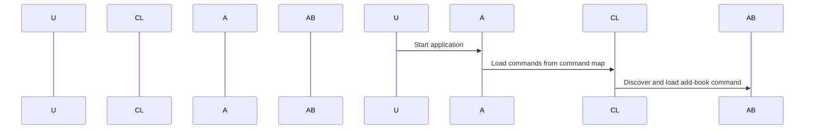

# Chapter 5: Command Discovery and Loading

## Motivation

In our previous chapters, we learned how to handle user inputs, validate them, and execute commands. But what if you want to add more commands or change existing ones easily? How do you make sure your application knows about all the available commands without needing to hard-code them everywhere?

Imagine you're organizing a book fair. You have different roles like registering authors, adding books, and listing available books. Each role is a command in our console app. To manage these efficiently, we need an easy way to discover and load these commands.

## Key Concepts

### 1. Command Discovery
Command discovery is like a librarian organizing books on shelves. It ensures all your book-related commands are neatly arranged so users can easily find them.

### 2. Command Loading
Loading commands means making sure the application knows about these commands when it starts up, similar to how you might check a catalog before setting up an event.

## How to Use This Abstraction

Let's see how we can use command discovery and loading in our library app:

1. **Define Commands**: We create different commands for adding books, removing books, and listing all books.
2. **Discover and Load Commands**: We make sure the application knows about these commands so it can handle them.

## Example Scenario: Adding Book Command

Let's define a simple command to add a book:

```php
// In AddBookCommand.php
class AddBookCommand extends Command {
    protected function configure() {
        $this
            ->setName('add-book')
            ->setDescription('Add a book to the library');
    }

    protected function execute(InputInterface $input, OutputInterface $output) {
        // Implementation details here
    }
}
```

### Explanation

- **Command Definition**: We create an `AddBookCommand` class that extends from Symfony's `Command`.
- **Configuration**: The `configure` method sets the name and description of the command.
- **Execution**: In the `execute` method, we can add logic to handle adding a book.

## Example Code

Now, let's see how we can discover and load these commands:

```php
<?php

use Symfony\Component\Console\Application;
use Symfony\Component\Console\CommandLoader\ContainerCommandLoader;

// Create an Application instance
$application = new Application('Library App', '1.0');

// Define the command map with command names as keys and service ids as values
$commandMap = [
    'add-book' => AddBookCommand::class,
];

// Load commands using ContainerCommandLoader
$loader = new ContainerCommandLoader($application->getContainer(), $commandMap);
$application->setCommandLoader($loader);

// Run the application
$exitCode = $application->run();
```

### Explanation

- **Application Instance**: We create an `Application` instance with a name and version.
- **Command Map**: We define a map that links command names to their respective classes.
- **Loading Commands**: Using `ContainerCommandLoader`, we load the commands from our application container.

## Internal Implementation

Let's see how the internal implementation works:

1. **User Starts Application**:
   - The user starts the application and calls the `run` method.
2. **Application Loads Commands**:
   - The application uses the command loader to discover and load all available commands based on our defined map.

### Sequence Diagram

Here’s a simple sequence diagram illustrating how this works:



### Explanation of Sequence Diagram

- **User Starts Application**: The user initiates the application.
- **Application Loads Commands**: The application uses `ContainerCommandLoader` to discover and load all available commands.
- **Discover and Load Command**: The loader finds the `AddBookCommand` class and loads it.

## Conclusion

In this chapter, we learned about command discovery and loading. We saw how to define commands and ensure our application knows about them when it starts up. Next, we’ll explore more advanced concepts like signal handling!

Stay tuned for the next chapter: [Signal Handling](06_signal_handling_.md)

---

Generated by [AI Codebase Knowledge Builder](https://github.com/The-Pocket/Tutorial-Codebase-Knowledge)