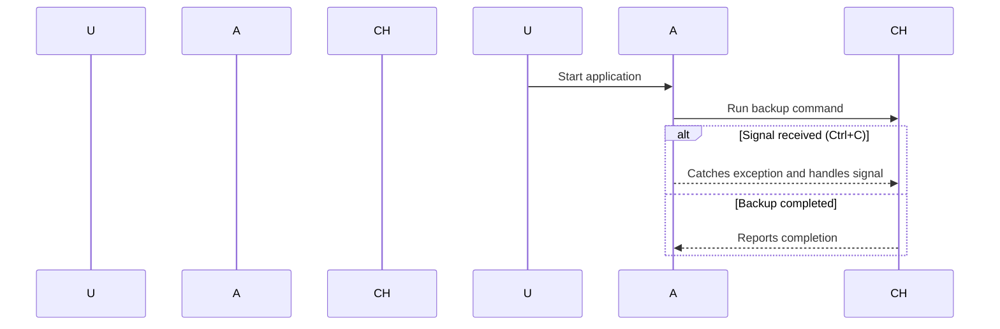

# Chapter 6: Signal Handling

## Motivation

In our previous chapters, we learned how to handle user inputs and validate them before processing commands. However, sometimes the application might need to react to external events or signals that come from outside. Think of it like a traffic light system where different lights (signals) trigger actions in the console app.

Imagine you're building an application that runs on a server. Sometimes, this server needs to stop running the application due to certain conditions—like when the server is shut down or receives a specific command. In these situations, we need to catch and handle such signals.

## Key Concepts

### 1. What is a Signal?
A signal is like an emergency bell that rings in your console app. It's a notification from outside (e.g., operating system) that something important has happened.

### 2. Handling Signals
Handling signals means setting up listeners to catch these bells and take appropriate actions, just as you would listen for fire alarms and evacuate the building accordingly.

## How to Use Signal Handling

Let's use an example: You're developing a backup tool that should run every night. However, if someone sends a shutdown signal (like pressing `Ctrl+C`), your application needs to stop running gracefully instead of crashing.

### Example Scenario: Backup Tool

1. **User Starts Application**: The user runs the backup tool.
2. **Backup in Progress**: The app starts backing up files.
3. **Signal Received**: If someone sends a shutdown signal, the app stops and exits cleanly.

## Code to Handle Signals

Here's how we can handle signals in our application:

```php
<?php

use Symfony\Component\Console\Application;
use Symfony\Component\Console\Input\ArrayInput;
use Symfony\Component\Console\Output\NullOutput;

// Create an Application instance
$application = new Application('Backup Tool', '1.0');

// Define the command to run backups
class BackupCommand extends Command {
    protected function configure() {
        $this
            ->setName('backup')
            ->setDescription('Run a backup of the files');
    }

    protected function execute(InputInterface $input, OutputInterface $output) {
        // Perform file backup logic here
        echo "Starting backup...\n";
        sleep(5);  // Simulate backup process
        echo "Backup completed!\n";
    }
}

// Add the command to the application
$application->add(new BackupCommand());

// Run the application
try {
    $exitCode = $application->run(new ArrayInput([]), new NullOutput());
} catch (\Exception $e) {
    // Handle signals by catching exceptions
    echo "Caught an exception: " . $e->getMessage() . "\n";
}
```

### Explanation

1. **Application Instance**: We create a `Symfony\Component\Console\Application` instance with the app name and version.
2. **Command Definition**: We define a `BackupCommand` to handle file backups.
3. **Running Application**: We try to run the application using `run` method, which catches exceptions thrown by signals.

## Internal Implementation

Let's see what happens step-by-step:

1. **User Starts Application**:
   - The user runs the backup tool.
2. **Application Runs Command**:
   - The app starts performing file backups.
3. **Signal Received**:
   - If a signal is received, it throws an exception which we catch and handle.

### Sequence Diagram

Here’s a simple sequence diagram illustrating how this works:



### Explanation of Sequence Diagram

- **User Starts Application**: The user initiates the application.
- **Application Runs Command**: The app starts running the backup command.
- **Signal Received (Ctrl+C)**: If a signal is received, it catches and handles the exception gracefully.
- **Backup Completed**: If no signals are caught, the backup process completes.

## Conclusion

In this chapter, we learned how to handle signals in our console application. We saw how to set up listeners for external events and ensure that our app behaves correctly when receiving these signals. Next, we'll explore more advanced concepts like logging and debugging!

Stay tuned for the next chapter: [Logging and Debugging](07_logging_and_debugging_.md)

---

Generated by [AI Codebase Knowledge Builder](https://github.com/The-Pocket/Tutorial-Codebase-Knowledge)