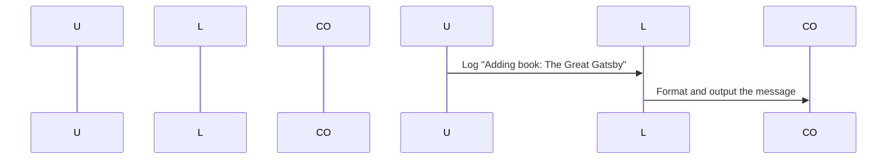

# Chapter 7: Logging and Debugging

Welcome back! In our last chapters, we explored how to handle user inputs, validate them, execute commands, and even discover and load different commands. But what happens when something goes wrong in your application? How do you know where the issue is coming from or if everything is working as expected? This is where logging and debugging come into play.

Imagine you're building a library management system. You want to make sure that every time a book is added, removed, or updated, there's a record of what happened. Logging helps you track these events so you can understand the flow of your application and debug any issues if they arise.

## What is Logging?

Logging is like keeping a diary for your console app. It records important information about what’s happening inside the application, such as actions performed by users or errors that occur. This information can be very useful when troubleshooting problems.

### Example Scenario: Adding Books

Let's say you have a command to add books in your library management system. You want to log every time someone adds a book so you can keep track of all additions and make sure nothing is missed.

## How to Use Logging

In our example, we'll use the `ConsoleLogger` class from Symfony Console to handle logging. This class helps us write logs to the console or file in a structured way.

### Example Code

Here’s how we can set up basic logging:

```php
<?php

use Symfony\Component\Console\Output\ConsoleOutput;
use Symfony\Component\Console\Logger\ConsoleLogger;

// Create a logger instance
$logger = new ConsoleLogger(new ConsoleOutput());

// Log some information
$logger->info('Adding book: The Great Gatsby');
```

### Explanation

1. **Creating a Logger**: We create an instance of `ConsoleLogger` which takes care of logging to the console.
2. **Logging Information**: Using the `info` method, we log a message when adding a book.

## How It Works Internally

Let’s see how the internal implementation works:

### Step-by-Step Walkthrough

1. **User Initiates Command**: The user runs an add-book command.
2. **Logger Catches Event**: When logging happens (e.g., `info` method is called), the logger formats and outputs the message to the console.

### Sequence Diagram

Here’s a simple sequence diagram illustrating how this works:



### Explanation of Sequence Diagram

- **User Initiates Command**: The user runs an add-book command.
- **Logger Catches Event**: When logging happens, the logger formats the message.
- **Output to Console**: The formatted message is sent to the console.

## Setting Up Error Logging

Sometimes, you might want to log errors differently from regular information. For example, if something goes wrong during the book addition process, you may want to highlight it more prominently.

### Example Code for Error Logging

```php
<?php

use Symfony\Component\Console\Output\ConsoleOutput;
use Symfony\Component\Console\Logger\ConsoleLogger;

// Create a logger instance
$logger = new ConsoleLogger(new ConsoleOutput());

try {
    // Attempt to add a book
    $bookId = addBook("The Great Gatsby", "F. Scott Fitzgerald");
} catch (\Exception $e) {
    // Log the error with a higher severity level
    $logger->error('Failed to add book: ' . $e->getMessage());
}

function addBook($title, $author) {
    // Simulated function that might throw an exception
    if ($title === "The Great Gatsby") {
        throw new \Exception("Title already exists.");
    }
    
    return 123456;
}
```

### Explanation

1. **Creating a Logger**: We create an instance of `ConsoleLogger` with `ConsoleOutput`.
2. **Error Handling**: Inside the try-catch block, we attempt to add a book and catch any exceptions.
3. **Logging Error**: If an error occurs, we log it using the `error` method.

## Internal Implementation

Now let's dive deeper into how logging works internally:

### Code Breakdown

1. **Logger Class**: The `ConsoleLogger` class handles the formatting and output of logs.
2. **Logging Methods**: Methods like `info`, `error`, etc., format and send messages to the console or file.

### Example Code for ConsoleLogger

```php
class ConsoleLogger extends AbstractLogger
{
    public function log($level, $message, array $context = [])
    {
        if ($level === LogLevel::ERROR) {
            // Log errors with a higher verbosity level
            $this->output->getErrorOutput()->writeln("<error>$message</error>");
        } else {
            // Log other messages at the appropriate verbosity level
            $this->output->writeln($message);
        }
    }
}
```

### Explanation

1. **Logging Levels**: The `log` method checks the log level and outputs the message to the appropriate output.
2. **Formatting Messages**: Messages are formatted using placeholders for context values.

## Conclusion

In this chapter, we learned about logging in our console application. We saw how to set up basic logging and handle error logging to keep track of important events. This helps us debug issues and understand the flow of our application.

Next, we'll explore debugging techniques that complement logging. Debugging allows us to inspect the state of the application at different points to find and fix issues more efficiently.

Stay tuned for the next chapter: [Debugging Techniques](07_debugging_techniques_.md)

---

Generated by [AI Codebase Knowledge Builder](https://github.com/The-Pocket/Tutorial-Codebase-Knowledge)