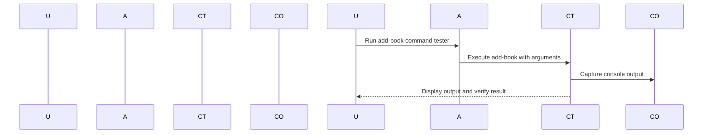

# Chapter 8: Command Testing

## Transition from Previous Chapter

In our last chapter, we explored logging and debugging techniques to keep track of what's happening inside our console application. Now, let's move on to another crucial aspect—testing commands. This is like practicing a musical piece before performing it in front of an audience.

## Motivation

Imagine you're building a library management system where users can add, remove, or search for books. Before releasing this system, you want to make sure that each command works perfectly without any issues. How do you ensure everything runs smoothly? This is where **command testing** comes into play.

Command testing allows you to write tests for your commands so that you can validate their behavior and ensure they work as expected before deploying them in a production environment. Just like practicing a piece of music multiple times, command testing helps you fine-tune each part until it sounds perfect.

## Key Concepts

### 1. What is Command Testing?

Command testing is about creating test cases for your console commands to verify that they behave correctly. It's like setting up a practice room where developers can test their musical compositions before performing them in public.

### Example Scenario: Adding a Book

Let's say we have an `add-book` command. We want to ensure it works correctly by testing various scenarios:
- Adding a book with valid data.
- Handling invalid inputs (e.g., negative price or empty title).
- Checking if the book is added successfully.

## How to Use Command Testing

### Setting Up Test Cases

To start, we'll use a test case class provided by Symfony Console. This class helps us write tests for our commands easily.

#### Example Code
Here’s how you can set up a basic command test:

```php
<?php

use Symfony\Component\Console\Tester\CommandTester;
use Symfony\Component\Console\Application;

// Create an Application instance with your commands loaded.
$application = new Application();
$command = $application->find('add-book');

// Create a CommandTester to run the command in a test environment.
$commandTester = new CommandTester($command);

// Run the command and capture its output.
$commandTester->execute([
    'title' => 'The Great Gatsby',
    'author' => 'F. Scott Fitzgerald',
    'price' => 10,
]);

// Check if the book was added successfully.
$output = $commandTester->getDisplay();
if (strpos($output, "Book added successfully") !== false) {
    echo "Test passed: Book added successfully.\n";
} else {
    echo "Test failed: Book addition did not work as expected.\n";
}
```

### Explanation

1. **Create Application Instance**: We create an `Application` instance and load our commands.
2. **Find Command**: Using the `find` method, we locate the `add-book` command.
3. **Command Tester**: We use a `CommandTester` to run the command in a test environment.
4. **Execute Command**: We pass arguments to the command and capture its output.
5. **Check Output**: We verify if the book was added successfully by checking the output.

## Internal Implementation

Let's see what happens step-by-step when we run this code:

1. **User Starts Application**: The user runs the test script.
2. **Application Runs Command**: The `CommandTester` runs the command with provided arguments.
3. **Capture Output**: It captures the console output to check if the book was added successfully.

### Sequence Diagram

Here’s a simple sequence diagram illustrating how this works:



### Explanation of Sequence Diagram

- **User Starts Application**: The user runs the test script.
- **Application Runs Command Tester**: The `CommandTester` executes the command with specified arguments.
- **Capture Console Output**: It captures the console output to check the result.
- **Display Result**: Finally, it displays the output and verifies if the book was added successfully.

## Conclusion

In this chapter, we learned about command testing in our console application. We saw how to set up test cases for commands to ensure they work as expected. This helps us catch any issues early on before deploying them in a production environment.

Next, we'll explore more advanced concepts like output wrapping and formatting! [Next Chapter: Output Wrapping](09_output_wrapping_.md)

---

Generated by [AI Codebase Knowledge Builder](https://github.com/The-Pocket/Tutorial-Codebase-Knowledge)