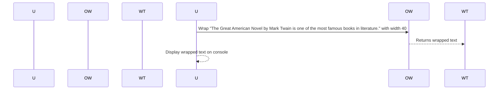

# Chapter 9: Output Wrapping

## Transition from Previous Chapter

In our previous chapter on [Output and Formatting](10_output_and_formatting_.md), we learned about making our console application's output look neat and pretty. Now, let's dive deeper into a specific aspect of formatting—ensuring that long lines don't go beyond the terminal width. This is like when you're writing an essay and want to make sure each line fits neatly on the page.

## Motivation

Imagine you're working on a library management system where users can see lists of books. When there are many books, some titles might be very long. If these titles go beyond the terminal width, it can look messy and hard to read. This is where output wrapping comes into play!

Output wrapping means breaking up long lines so they fit nicely within the terminal width. It's like manually adjusting each line in a paragraph to make sure no word goes beyond the margin.

## Key Concepts

### 1. What is Output Wrapping?

Output wrapping is about taking text and breaking it into smaller, manageable pieces that fit within the terminal width. This ensures the output looks clean and readable.

### Example Scenario: Book List

Suppose you have a list of books in your library management system. Each book title might be long, like "The Great American Novel by Mark Twain". If this title goes beyond the terminal width, it will look messy. Output wrapping helps break this line into smaller pieces so it fits neatly.

## How to Use Output Wrapping

Let's see how we can use output wrapping in our application:

### Example Code

Here’s a simple example of using output wrapping:

```php
<?php

use Symfony\Component\Console\Helper\OutputWrapper;

// Create an instance of OutputWrapper with default settings.
$outputWrapper = new OutputWrapper();

$text = "The Great American Novel by Mark Twain is one of the most famous books in literature.";
$wrappedText = $outputWrapper->wrap($text, 40);

echo $wrappedText;
```

### Explanation

1. **Create an Instance**: We create a `OutputWrapper` instance.
2. **Wrap Text**: The `wrap` method takes the text and the desired width as arguments. It returns the wrapped text.

The output might look like this:

```
The Great American Novel by M
ark Twain is one of the mo
st famous books in literatu
re.
```

Now, let's break down what happens step-by-step when we run this code:

1. **User Runs Code**: The user runs the script to see the wrapped text.
2. **Wrap Text**: The `wrap` method processes the text and breaks it into smaller pieces that fit within the specified width.

### Sequence Diagram

Here’s a simple sequence diagram illustrating how this works:



### Explanation of Sequence Diagram

- **User Runs Code**: The user runs the script.
- **Wrap Text**: The `OutputWrapper` processes the input text and wraps it to fit within the specified width.
- **Display Wrapped Text**: The result is displayed on the console.

## Internal Implementation

Now, let's take a closer look at how the internal implementation works:

### Code Breakdown

The `wrap` method uses regular expressions and pattern matching to break up lines. Here’s a simplified version of what happens inside:

```php
class OutputWrapper {
    private $allowCutUrls = false;

    public function wrap(string $text, int $width): string {
        if (!$width) {
            return $text;
        }

        // Define patterns for tags and URLs
        $tagPattern = '<[a-z](?:[^\\\\<>]*+ | \\\\.)*/(?:[a-z][^<>]*+)?>';
        $urlPattern = 'https?://\S+';

        // Create the pattern to match text within the width limit
        $rowPattern = "(?:$tagPattern|$urlPattern|.){1,$width}(?:\r?\n)?";
        $pattern = "#(?:((?>(?$1)((?<=[^\S\r\n])[^\S\r\n]?|(?=\r?\n)|$|[^\S\r\n]))|($tagPattern))(?:\r?\n)?|(?:\r?\n|$))#imux";

        // Replace the text with wrapped lines
        $output = preg_replace($pattern, '\\1', $text);

        return str_replace(' '.$break, $break, $output);
    }
}
```

### Explanation

1. **Check Width**: If no width is specified, it returns the original text.
2. **Define Patterns**: It defines patterns for tags and URLs to handle them separately.
3. **Create Pattern**: It creates a pattern that matches lines within the specified width limit.
4. **Replace Text**: It uses `preg_replace` to replace the original text with wrapped lines.

## Conclusion

In this chapter, we learned about output wrapping in our console application. We saw how to ensure long text fits nicely within terminal width using the `OutputWrapper` class. This helps make our output look clean and readable.

Next, we'll explore more advanced concepts like handling URLs in wrapped text! [Next Chapter: Output Handling](10_output_and_formatting_.md)

---

Generated by [AI Codebase Knowledge Builder](https://github.com/The-Pocket/Tutorial-Codebase-Knowledge)