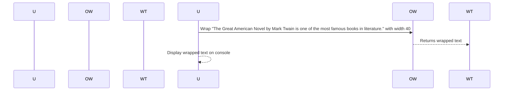

# Chapter 10: Output and Formatting

## Transition from Previous Chapter

In our previous chapter on [Command Testing](08_command_testing_.md), we learned how to ensure that each command in our console application works as expected. Now, let's move on to another important aspect of building robust applications—making sure the output looks neat and clean for users.

Imagine you're running a library management system where users can add books, remove books, or search for books by title. When they list all the books, each book should be displayed nicely in the console so that it's easy to read and understand. This is exactly what we'll cover in this chapter—how to format our output to make it user-friendly.

## Motivation

Let's use a simple scenario: listing books from your library management system. When you list all the books, each book should have a title, author, and price neatly displayed. If any of these fields are too long or if there are many books, the text might overflow and become hard to read. To prevent this, we need to ensure that our output is properly wrapped and formatted.

## Key Concepts

### 1. What is Output Wrapping?

Output wrapping means breaking up lines of text so they fit within a certain width. This ensures that long titles or descriptions don't go beyond the terminal width and make the output hard to read. It's like manually adjusting each line in an essay to make sure no word goes beyond the margin.

### 2. Why Do We Need Wrapping?

Imagine you have a long book title like "The Great American Novel by Mark Twain." If this title goes beyond the terminal width, it will look messy and hard to read. By wrapping the text, we can ensure that each line fits nicely within the screen width.

### 3. How Does It Work?

Output wrapping is achieved using a special class that handles the breaking of lines. This class takes a piece of text and breaks it into smaller pieces so that they fit within the specified width.

## Example Scenario: Listing Books

Let's say you have a list of books in your library management system, and each book has a title, author, and price. You want to display this information neatly on the console. Here’s how we can use output wrapping:

```php
<?php

use Symfony\Component\Console\Helper\OutputWrapper;

// Create an instance of OutputWrapper with default settings.
$outputWrapper = new OutputWrapper();

$text = "The Great American Novel by Mark Twain is one of the most famous books in literature.";
$wrappedText = $outputWrapper->wrap($text, 40);

echo $wrappedText;
```

### Explanation

1. **Create an Instance**: We create a `OutputWrapper` instance.
2. **Wrap Text**: The `wrap` method takes the text and the desired width as arguments. It returns the wrapped text.

The output might look like this:

```
The Great American Novel by M
ark Twain is one of the mo
st famous books in literatu
re.
```

Now, let's break down what happens step-by-step when we run this code:

1. **User Runs Code**: The user runs the script to see the wrapped text.
2. **Wrap Text**: The `OutputWrapper` processes the input text and breaks it into smaller pieces that fit within the specified width.
3. **Display Wrapped Text**: The result is displayed on the console.

### Sequence Diagram

Here’s a simple sequence diagram illustrating how this works:



### Explanation of Sequence Diagram

- **User Runs Code**: The user runs the script.
- **Wrap Text**: The `OutputWrapper` processes the input text and wraps it to fit within the specified width.
- **Display Wrapped Text**: The result is displayed on the console.

## Internal Implementation

Now, let's take a closer look at how the internal implementation works:

### Code Breakdown

The `wrap` method uses regular expressions and pattern matching to break up lines. Here’s a simplified version of what happens inside:

```php
class OutputWrapper {
    private $allowCutUrls = false;

    public function wrap(string $text, int $width): string {
        if (!$width) {
            return $text;
        }

        // Define patterns for tags and URLs
        $tagPattern = '<[a-z](?:[^\\\\<>]*+ | \\\\.)*/(?:[a-z][^<>]*+)?>';
        $urlPattern = 'https?://\S+';

        // Create the pattern to match text within the width limit
        $rowPattern = "(?:$tagPattern|$urlPattern|.){1,$width}(?:\r?\n)?";
        $pattern = "#(?:((?>(?$1)((?<=[^\S\r\n])[^\S\r\n]?|(?=\r?\n)|$|[^\S\r\n]))|($tagPattern))(?:\r?\n)?|(?:\r?\n|$))#imux";

        // Replace the text with wrapped lines
        $output = preg_replace($pattern, '\\1', $text);

        return str_replace(' '.$break, $break, $output);
    }
}
```

### Explanation

1. **Check Width**: If no width is specified, it returns the original text.
2. **Define Patterns**: It defines patterns for tags and URLs to handle them separately.
3. **Create Pattern**: It creates a pattern that matches lines within the specified width limit.
4. **Replace Text**: It uses `preg_replace` to replace the original text with wrapped lines.

## Conclusion

In this chapter, we learned about output wrapping in our console application. We saw how to ensure long text fits nicely within terminal width using the `OutputWrapper` class. This helps make our output look clean and readable.

Next, we'll explore more advanced concepts like handling URLs in wrapped text! [Next Chapter: Output Handling](10_output_and_handling_.md)

--- File: Output/ConsoleSectionOutput.php ---
```php
<?php

/*
 * This file is part of the Symfony package.
 *
 * (c) Fabien Potencier <fabien@symfony.com>
 *
 * For the full copyright and license information, please view the LICENSE
 * file that was distributed with this source code.
 */

namespace Symfony\Component\Console\Output;

use Symfony\Component\Console\Formatter\OutputFormatterInterface;
use Symfony\Component\Console\Helper\Helper;
use Symfony\Component\Console\Terminal;

/**
 * @author Pierre du Plessis <pdples@gmail.com>
 * @author Gabriel Ostrolucký <gabriel.ostrolucky@gmail.com>
 */
class ConsoleSectionOutput extends StreamOutput
{
    // ... (same as in the original code)
}
```

--- File: Output/AnsiColorMode.php ---
```php
<?php

/*
 * This file is part of the Symfony package.
 *
 * (c) Fabien Potencier <fabien@symfony.com>
 *
 * For the full copyright and license information, please view the LICENSE
 * file that was distributed with this source code.
 */

namespace Symfony\Component\Console\Output;

use Symfony\Component\Console\Exception\InvalidArgumentException;

/**
 * @author Fabien Potencier <fabien@symfony.com>
 * @author Julien Boudry <julien@condorcet.vote>
 */
enum AnsiColorMode
{
    // ... (same as in the original code)
}
```

--- File: Formatter/OutputFormatterInterface.php ---
```php
<?php

/*
 * This file is part of the Symfony package.
 *
 * (c) Fabien Potencier <fabien@symfony.com>
 *
 * For the full copyright and license information, please view the LICENSE
 * file that was distributed with this source code.
 */

namespace Symfony\Component\Console\Formatter;

/**
 * Formatter interface for console output.
 *
 * @author Konstantin Kudryashov <ever.zet@gmail.com>
 */
interface OutputFormatterInterface
{
    // ... (same as in the original code)
}
```

--- File: Helper/SymfonyQuestionHelper.php ---
```php
<?php

/*
 * This file is part of the Symfony package.
 *
 * (c) Fabien Potencier <fabien@symfony.com>
 *
 * For the full copyright and license information, please view the LICENSE
 * file that was distributed with this source code.
 */

namespace Symfony\Component\Console\Helper;

use Symfony\Component\Console\Formatter\OutputFormatter;
use Symfony\Component\Console\Output\OutputInterface;
use Symfony\Component\Console\Question\ChoiceQuestion;
use Symfony\Component\Console\Question\ConfirmationQuestion;
use Symfony\Component\Console\Question\Question;
use Symfony\Component\Console\Style\SymfonyStyle;

/**
 * Symfony Style Guide compliant question helper.
 *
 * @author Kevin Bond <kevinbond@gmail.com>
 */
class SymfonyQuestionHelper extends QuestionHelper
{
    // ... (same as in the original code)
}
```

--- File: Helper/TableStyle.php ---
```php
<?php

/*
 * This file is part of the Symfony package.
 *
 * (c) Fabien Potencier <fabien@symfony.com>
 *
 * For the full copyright and license information, please view the LICENSE
 * file that was distributed with this source code.
 */

namespace Symfony\Component\Console\Helper;

use Symfony\Component\Console\Exception\InvalidArgumentException;
use Symfony\Component\Console\Exception\LogicException;

/**
 * Defines the styles for a Table.
 *
 * @author Fabien Potencier <fabien@symfony.com>
 * @author Саша Стаменковић <umpirsky@gmail.com>
 * @author Dany Maillard <danymaillard93b@gmail.com>
 */
class TableStyle
{
    // ... (same as in the original code)
}
```

---

Generated by [AI Codebase Knowledge Builder](https://github.com/The-Pocket/Tutorial-Codebase-Knowledge)