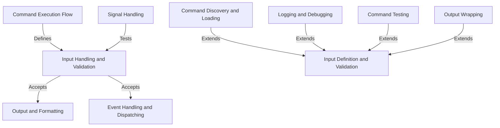

# Tutorial: console

This project provides a framework for creating and managing command-line interfaces (CLI) in PHP applications.
Key abstractions like `Command`, `InputArgument`, and `InputOption` enable developers to define CLI commands,
handle user input, and manage the output of their applications.

**Source Repository:** [https://github.com/symfony/console.git](https://github.com/symfony/console.git)

## Chapters

1. [Input Handling and Validation
](01_input_handling_and_validation_.md)
2. [Input Definition and Validation
](02_input_definition_and_validation_.md)
3. [Event Handling and Dispatching
](03_event_handling_and_dispatching_.md)
4. [Command Execution Flow
](04_command_execution_flow_.md)
5. [Command Discovery and Loading
](05_command_discovery_and_loading_.md)
6. [Signal Handling
](06_signal_handling_.md)
7. [Logging and Debugging
](07_logging_and_debugging_.md)
8. [Command Testing
](08_command_testing_.md)
9. [Output Wrapping
](09_output_wrapping_.md)
10. [Output and Formatting
](10_output_and_formatting_.md)

---

Generated by [AI Codebase Knowledge Builder](https://github.com/The-Pocket/Tutorial-Codebase-Knowledge)